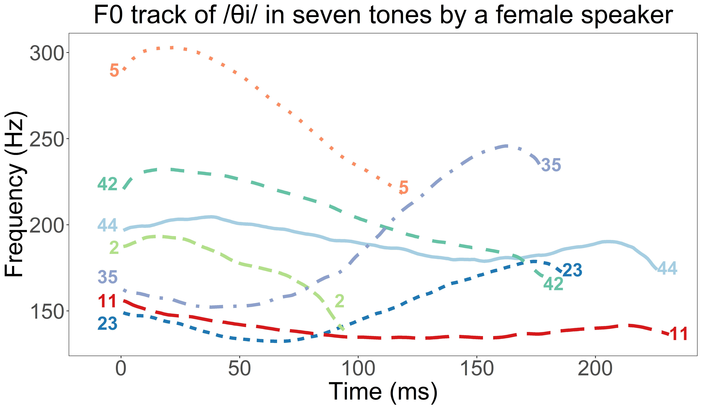

```{r echo=FALSE, message = FALSE}
knitr::opts_chunk$set(echo = FALSE,
                     fig.align = 'center',
                     options(warn=-1))
suppressMessages(library(rmarkdown))
suppressMessages(library(knitr))
```


***
### Checked syllable
Checked syllables usually have the characteristics of being short, having glottalization at the end of the syllable, and being associated with specific tones. Such syllables are usually found in Chinese languages and Otomanguean languages. Xiapu Min, the language I do fieldwork on, has such syllables (i.e. Checked tone 5 /θiʔ5/湿 "wet"). However, there has not been consensus on what the acoustic and articulatory features of checked syllables are cross-linguistically. My dissertation topic is "Production and perception of checked syllable", aiming to investigate how checked syllables are produced and what acoustic features are important for listeners to identify a checked syllable.

***
### Fieldwork on San Francisco Yatee Zapotec

San Francisco Yatee Zapotec is spoken in the town of San Francisco Yatee, north of Oaxaca, Mexico. I started the documentation work on Yatee Zapotec in the spring of 2020. I am currently doing remote fieldwork with a speaker of Yatee Zapotec. My main goal is to figure out the sound system of Yatee Zapotec while my main focus is on the phonation type, tone, and their interaction in the language.


***
### Fieldwork on Xiapu Min

Xiapu Min is a variety of Min language mainly spoken in the county of Xiapu in southeastern China with approximately 500, 000 speakers. I started the documentation work on Xiapu Min in the summer of 2018. I am currently investigating the tone sandhi system of Xiapumin through measuring the degree of acoustic and articulatory neutralization after tone sandhi. The picture below is a F0 track of the seven tones in Xiapu Min.

<center>

</center>


***

### Voice quality

I am interested in the production of voice quality in general. I have studied the effect of F0, utterance position, and sentence type on the production of creak in Mandarin utterances.

***

### Language acquisition

I study how the phonological system of people's native language influences their acquisition of non-native languages. My Master's thesis from CU Boulder discusses how Mandarin speakers discriminate English vowels, and whether their discrimination accuracies can be predicted by the way they assimilate English vowels into Mandarin categories.

